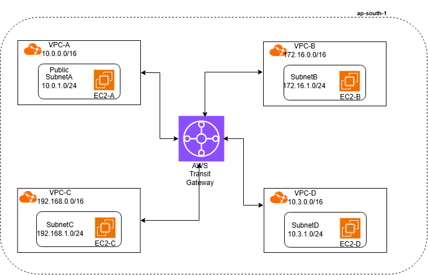
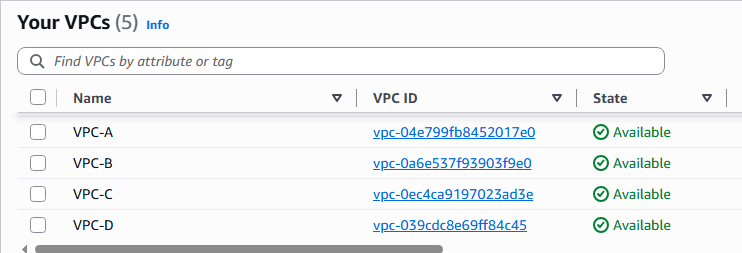
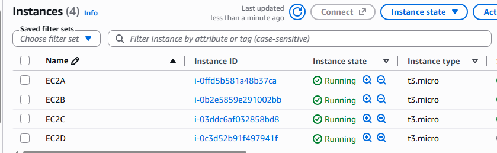
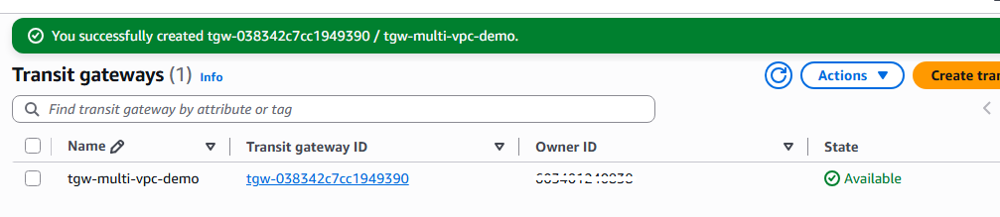
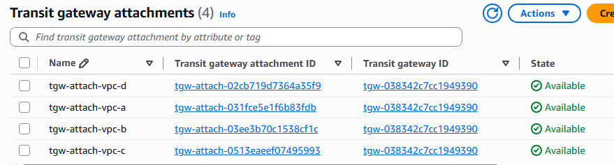
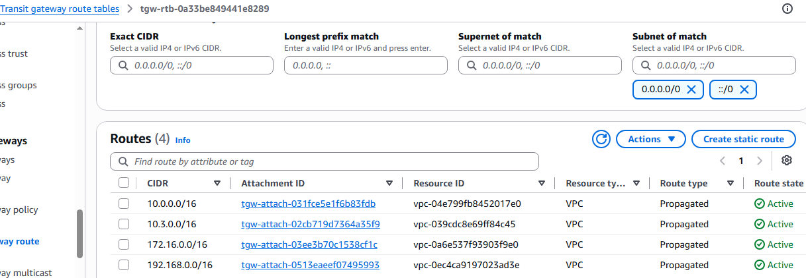
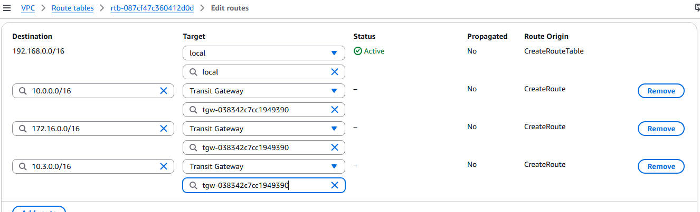
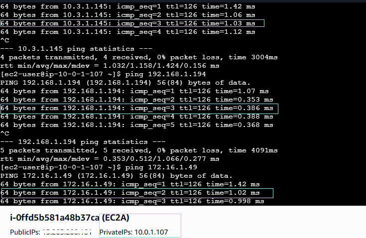
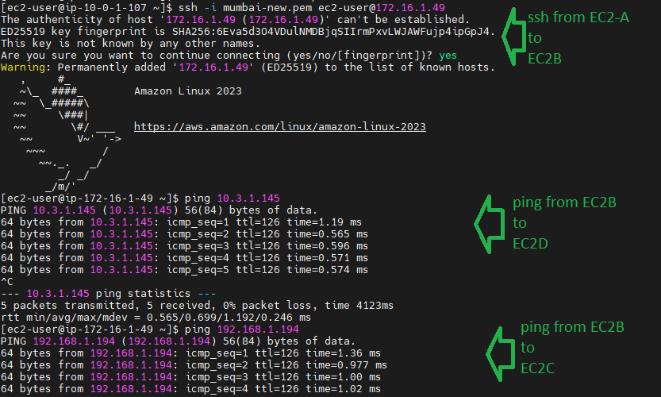
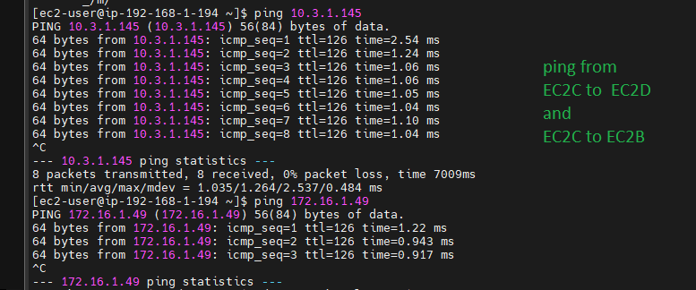

# Connecting Multiple VPCs Using AWS Transit Gateway (VPC-A, VPC-B, VPC-C, VPC-D)

## Overview

This project demonstrates how to connect **four separate Amazon VPCs (VPC-A, VPC-B, VPC-C, VPC-D)** using **AWS Transit Gateway (TGW)** — a centralized hub-and-spoke network architecture that eliminates the need for complex full-mesh VPC peering.

Instead of creating **6 separate peering connections** (the number required for a full mesh of 4 VPCs), Transit Gateway allows each VPC to attach to a single central hub, simplifying routing, scaling, and management.

---

## Objective

- Build 4 isolated VPCs, each in its own address space
- Create a Transit Gateway and attach all 4 VPCs to it
- Configure TGW route tables to control inter-VPC traffic flow
- Update each VPC's route table to send cross-VPC traffic via the TGW
- Validate connectivity between instances across VPCs
- Understand hub-and-spoke topology vs. full-mesh peering

---

## Architecture Diagram



*Each VPC attaches to the Transit Gateway independently. Traffic between any two VPCs is routed through the TGW rather than through direct peering links, giving a hub-and-spoke model instead of a full mesh.*

---

## Prerequisites
 
- An AWS account with permissions for VPC, EC2, and Transit Gateway
- AWS CLI or Console access
- Basic understanding of VPC networking, route tables, and security groups
- Free Tier-friendly instance types (e.g., `t2.micro` / `t3.micro`)

---
 
## Lab Steps
 
### Step 1: Create the Four VPCs
 
Create four VPCs, each with a non-overlapping CIDR block:
 
| VPC    | CIDR Block       | Subnet CIDR       | Region/AZ           | Subnet Type |
|--------|------------------|-------------------|-----------------------|-------------|
| VPC-A  | 10.0.0.0/16      | 10.0.1.0/24       | ap-south-1 (ap-south-1a) | Public (with IGW) |
| VPC-B  | 172.16.0.0/16    | 172.16.1.0/24     | ap-south-1 (ap-south-1b) | Private (no IGW) |
| VPC-C  | 192.168.0.0/16   | 192.168.1.0/24    | ap-south-1 (ap-south-1a) | Private (no IGW) |
| VPC-D  | 10.3.0.0/16      | 10.3.1.0/24       | ap-south-1 (ap-south-1b) | Private (no IGW) |

Only **VPC-A** needs an Internet Gateway attached and a `0.0.0.0/0 → IGW` route in its subnet's route table, since it hosts the bastion (EC2-A). VPC-B, VPC-C, and VPC-D use fully private subnets — no IGW, no public route.
 


---
 
### Step 2: Launch a Test EC2 Instance in Each VPC
 
Launch one EC2 instance per VPC:
 
- **EC2-A** (VPC-A, public subnet) — assign a public IP and a key pair; this is your bastion/jump host
- **EC2-B, EC2-C, EC2-D** (VPC-B/C/D, private subnets) — no public IP, no direct internet route
Use the **same key pair** across all four instances (or copy the private key onto EC2-A) so you can SSH from EC2-A into B, C, and D without extra setup.
 


---
 
### Step 3: Create the Transit Gateway
 
Navigate to **VPC Console → Transit Gateways → Create Transit Gateway**.
 
- Name: `tgw-multi-vpc-demo`
- Amazon side ASN: default
- Enable default route table association and propagation (or disable for manual control, depending on your design)


---
 
### Step 4: Attach Each VPC to the Transit Gateway
 
Create a **Transit Gateway VPC Attachment** for each of the 4 VPCs:
 
- `tgw-attach-vpc-a`
- `tgw-attach-vpc-b`
- `tgw-attach-vpc-c`
- `tgw-attach-vpc-d`
For each attachment, select the VPC and its associated subnet(s).
 


---
 
### Step 5: Configure Transit Gateway Route Tables
 
Review or create TGW route table(s) to define which attachments can route traffic to which. For a fully-meshed setup, associate all 4 attachments to the same TGW route table and propagate routes automatically.
 
For a segmented design (e.g., VPC-A and VPC-B isolated from VPC-C and VPC-D), create separate TGW route tables per group.
 


---
 
### Step 6: Update Each VPC's Route Table
 
In each VPC's subnet route table, add routes pointing to the Transit Gateway for the CIDR ranges of the other VPCs:
 
| VPC   | Destination                                        | Target |
|-------|-----------------------------------------------------|--------|
| VPC-A | 172.16.0.0/16, 192.168.0.0/16, 10.3.0.0/16          | TGW    |
| VPC-B | 10.0.0.0/16, 192.168.0.0/16, 10.3.0.0/16            | TGW    |
| VPC-C | 10.0.0.0/16, 172.16.0.0/16, 10.3.0.0/16             | TGW    |
| VPC-D | 10.0.0.0/16, 172.16.0.0/16, 192.168.0.0/16          | TGW    |
 


---
 
### Step 7: Update Security Groups
 
- **EC2-A's security group:** allow inbound SSH (22) from your laptop's public IP (or `0.0.0.0/0` for testing only)
- **EC2-B, EC2-C, EC2-D's security groups:** allow inbound SSH (22) and **All ICMP - IPv4** (not just Echo Request) from **VPC-A's CIDR (10.0.0.0/16)** — the bastion — **and from each other's CIDRs**, so that once you're on EC2-B (for example), you can also ping/SSH EC2-C and EC2-D directly rather than routing back through EC2-A each time. Selecting "All ICMP - IPv4" as the rule type (rather than a single ICMP type) ensures both the echo request and the echo reply are permitted, so `ping` actually returns a response.
| Instance | Rule | Source |
|----------|------|--------|
| EC2-A | SSH (22) | Your laptop's IP |
| EC2-B | SSH (22), All ICMP - IPv4 | 10.0.0.0/16, 192.168.0.0/16, 10.3.0.0/16 |
| EC2-C | SSH (22), All ICMP - IPv4 | 10.0.0.0/16, 172.16.0.0/16, 10.3.0.0/16 |
| EC2-D | SSH (22), All ICMP - IPv4 | 10.0.0.0/16, 172.16.0.0/16, 192.168.0.0/16 |
 
Without these rules, TGW routing alone will not let traffic through — the security group still has to explicitly permit it.

---
 
### Step 8: Validate Connectivity
 
Since EC2-B, EC2-C, and EC2-D have no public IP, EC2-A is the only way in — SSH into it first, then reach the others using their **private IPs** over the TGW path.
 
```bash
# 1. SSH into the bastion (EC2-A) from your laptop
ssh -i your-key.pem ec2-user@<EC2-A-public-IP>
 
# 2. From inside EC2-A, ping/SSH the private instances by their private IPs
ping 172.16.0.X          # EC2-B private IP
ping 192.168.0.X         # EC2-C private IP
ping 10.3.0.X             # EC2-D private IP
``` 



```bash
ssh -i your-key.pem ec2-user@172.16.0.X    # SSH into EC2-B via TGW
 
# 3. From inside EC2-B, you can now also reach EC2-C and EC2-D directly (SG rules allow it)
ping 192.168.0.X         # EC2-C private IP, from EC2-B
ping 10.3.0.X             # EC2-D private IP, from EC2-B
```
 


*OR*



A successful ping/SSH here confirms the full path: VPC-A route table → TGW attachment → Transit Gateway → TGW attachment → VPC-B/C/D route table → EC2-B/C/D — all without the traffic ever touching the internet.

---
 
## Results
 
- Successfully connected 4 VPCs via a single AWS Transit Gateway hub
- Verified connectivity from a public bastion (EC2-A) to three fully private instances (EC2-B, EC2-C, EC2-D) purely over private IPs
- Demonstrated reduced routing complexity vs. full-mesh VPC peering (1 hub vs. 6 peering connections)
- Confirmed that TGW routing works independently of internet access — private subnets need no IGW or NAT to reach each other

---
 
## Key Learnings
 
- **TGW beats full-mesh peering:** 4 VPCs need only 4 TGW attachments, vs. 6 separate peering connections.
- **A public IP doesn't connect VPCs:** it only lets the internet reach that one instance. Only TGW (or peering) lets VPCs talk to each other.
- **Routing comes before security groups:** if there's no route to the destination, the packet never gets there — the security group never even gets a say.
- **Private subnets work fine over TGW:** EC2-B/C/D don't need internet access to be reachable — just a route to the TGW.

---
 
## Cleanup
 
To avoid ongoing charges, delete resources in this order:
1. Terminate EC2 instances
2. Delete TGW VPC attachments
3. Delete the Transit Gateway
4. Delete VPC route table entries (or the VPCs themselves, if no longer needed)
---
 
## Tech Stack
 
`AWS VPC` `AWS Transit Gateway` `EC2` `Route Tables` `Security Groups` `Networking`
 
---
 
## Author

**Sinsha C**
 
## Connect

If you're on a similar DevOps learning journey, feel free to connect or follow along:

[](https://github.com/sinsha-c)
[](https://linkedin.com/in/sinshac)
